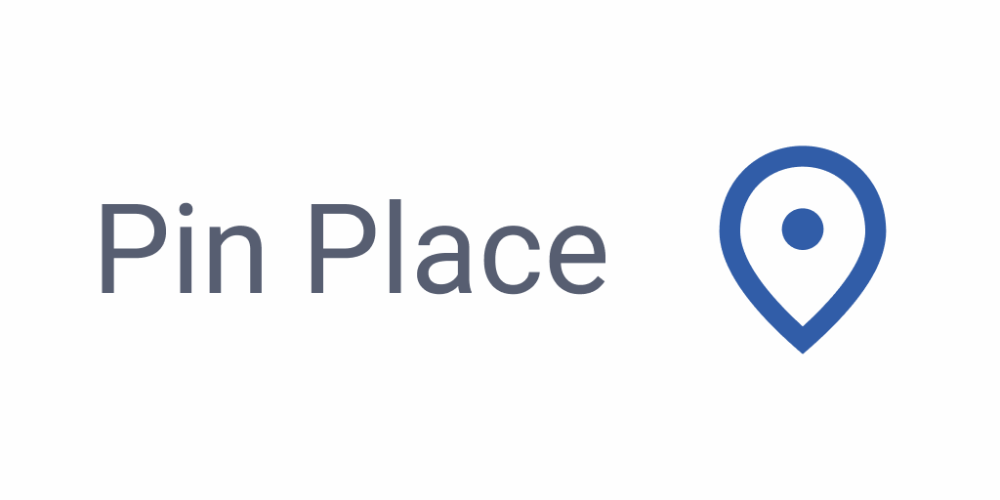
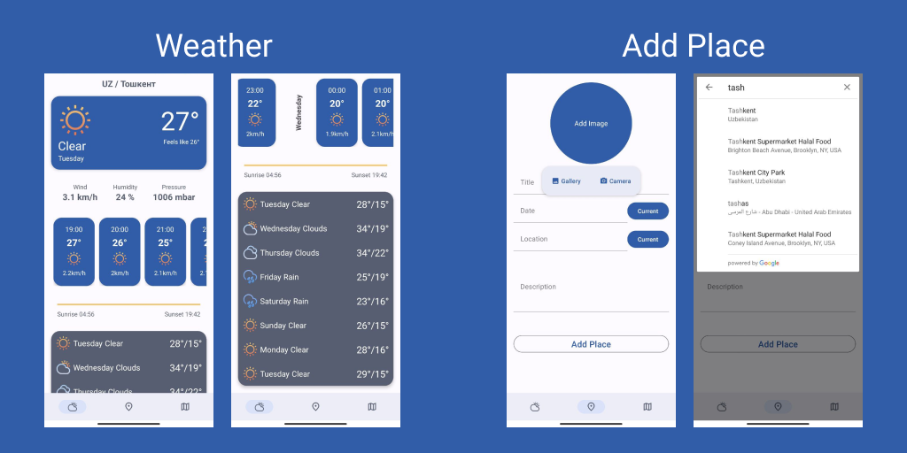
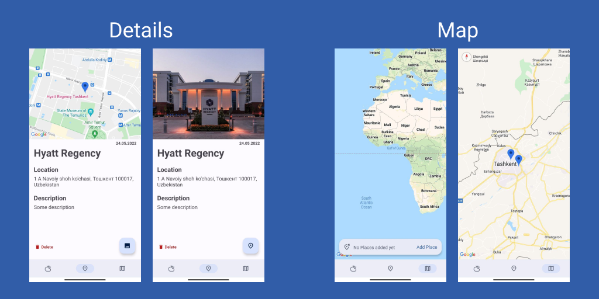

# Pin Place

_____

## Overview
Pin Place application was created by merging projects [WeatherApp](https://github.com/r-khvstnv/WeatherApp) and [MyPlaces](https://github.com/r-khvstnv/MyPlaces). The similarity of technologies used in each project was the reason for their uniting into one, and not updating each separately. Therefore, viewing the Weather is a Secondary Feature in relation to the main functionality.

The Primary Goal of Pin Place is provide possibility to store information of various locations and observe them on map. With further development, the project can be easily adapted to the needs of Tourism and Logistics Companies, as one of the modules.
  

## Technology Stack
- Kotlin
- Jetpack
	- Lifecycle
	- LiveData
	- ViewModel
	- Room
	- Navigation Component & safeArgs
- Dagger2
	 - Multibinding
- Retrofit2
- RxJava3
- API
	- [OpenWeather One Call](https://openweathermap.org/api)
	- [Places](https://developers.google.com/maps/documentation/places/web-service/overview)
	- [Maps](https://developers.google.com/maps/documentation/android-sdk)
- Glide
